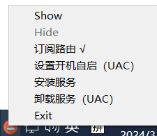
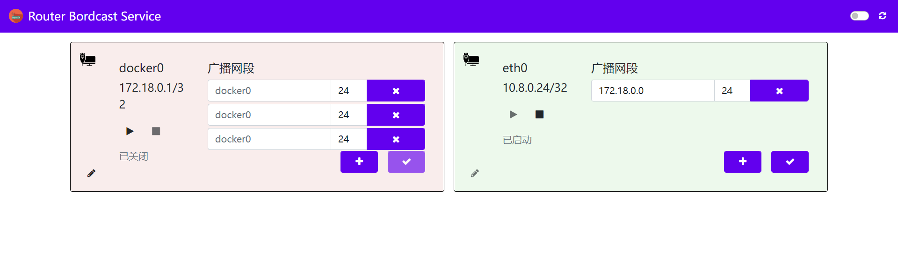
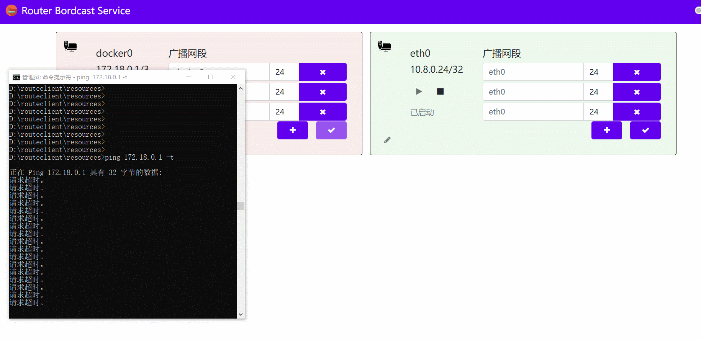
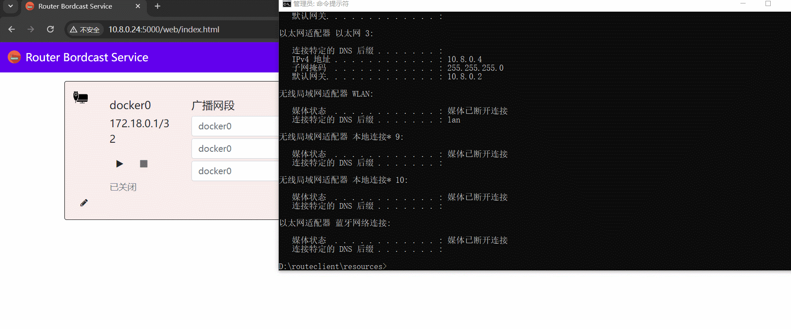

# routeclient

## 服务启动License
联系：1498472791@qq.com

## 路由广播服务
Windows 可用的仿`RIP(Routing Information Protocol)`服务，支持windows和linux。

服务端客户端可自定义路由信息，客户端可订阅路由信息。

### routeclient.exe
windows客户端程序，监听路由。支持开机自启，服务方式启动。



使用教程：
- 新建文件夹，将routeclient.exe复制到该文件夹
- 启动routeclient.exe
- 点击安装服务
- 点击订阅路由后，客户端即可收到路由信息


### server-x86
Linux 服务器程序，广播服务，支持根据网口自定义广播网段。



启动

`页面地址：http://IP:5000/web/index.html`
```bash
./server-x86
```

## 演示

### 启动广播



### 停止广播

